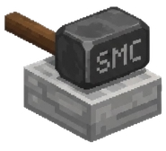

<p align="center">
  
</p>

# Sledge Launcher

The **Installer & Packager** for SledgeMC.

**Sledge Launcher** is the entry point for end-users, designed to prepare the Minecraft environment for SledgeMC with a focus on modern aesthetics and ease of use.

## Role
- Prepares the Minecraft environment for SledgeMC.
- Manages profile installation for various launchers.

## Features
- **Premium Dark UI**: A modern, card-based interface with high-end dark aesthetics.
- **TLauncher Integration**: Patches and installs profiles directly into the `.minecraft/versions` folder.
- **PrismLauncher Support**: Exports specialized `.zip` instances crafted specifically for Prism/MultiMC.
- **Custom Version Selector**: A polished interface for choosing the target Minecraft version.

## Build
To build the Launcher jar:
```bash
./gradlew clean build
```
**Note:** *Class purpose and authorship are documented in the headers of each class.*
